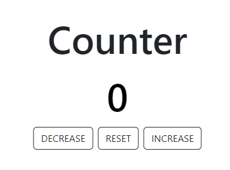

# Counter

This is a simple web application that allows users to increase, decrease and reset a counter. It was created using HTML, CSS, and JavaScript.

## Usage

To use the counter, simply open the `index.html` file in your web browser. You will see a counter displayed on the screen with three buttons: "INCREASE" to increase the count, "DESCREASE" to decrease the count, and "Reset" to reset the count to zero.

## Features

* Increase count
* Decrease count
* Reset count to zero

## Screenshots

